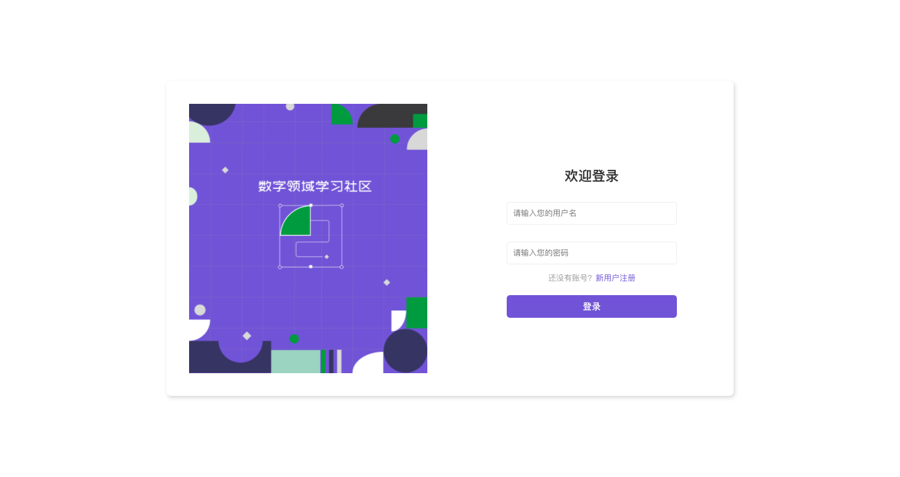
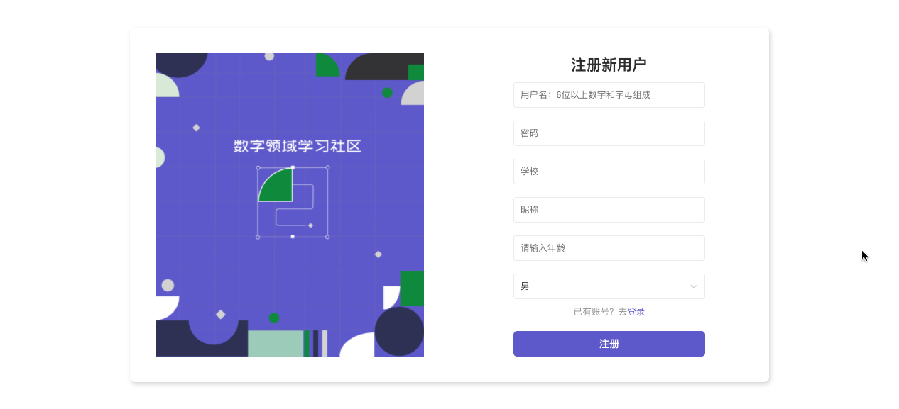
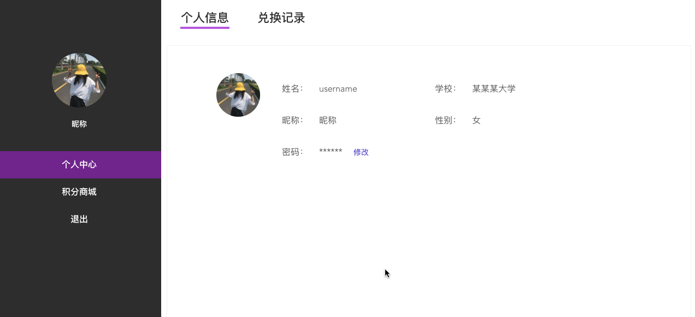
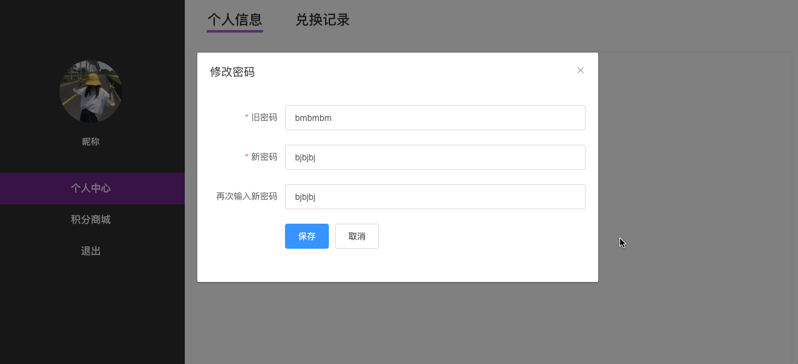
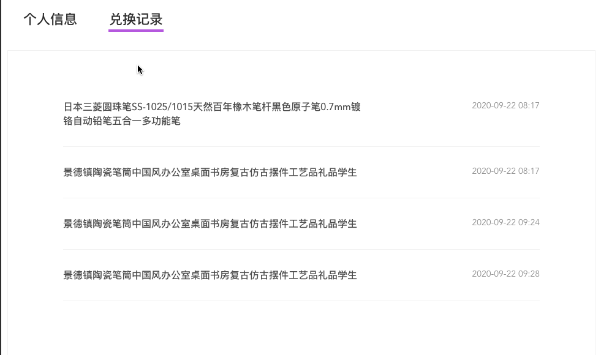
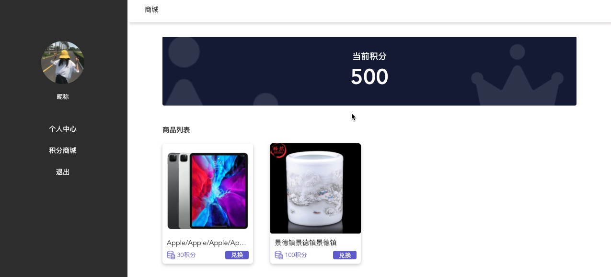

#### 项目要求


* 接口地址

```
http://49.235.98.65:3000/swagger
```


* 页面

```
1. 登录页面: 
2. 注册页面:
3. 个人中心页面: 

个人中心页面(嵌套路由形式)，里面包含
1. 积分商城: 
2. 个人中心:

个人中心又包含两个tab切换
1. 个人信息
2. 兑换记录
```


# 登录页





#### 登录页要求

* 点击新用户注册，跳转到注册页

* 登录成功后 用户信息存vuex，其他页面显示时从vuex内取


# 注册页





#### 注册页要求

* 注册信息验证
	* 用户名： 6位以上，中文或英文组成
	* 密码： 6位以上
	* 性别： 男是1，女是0

* 注册成功后接口没有返回用户信息，需要自己跳转到登录页，手动登录，登录成功跳转到个人中心页
* 点击已有账号？去登录，跳转到登录页面


# 个人中心（进入默认展示  子路由：个人中心）




### 个人中心子路由要求：

* 默认展示个人信息tab

* 个人信息，和兑换记录切换时，点击谁，谁下面显示紫色下划线

* 点击密码后面的修改按钮，弹出模态框，修改密码（密码需要输入两次，提交前需判断两次密码是否一致）




### 兑换记录tab

（显示兑换的商品名+兑换时间就可），时间格式需自己转化下（filter过滤器）




### 积分商城




#### 积分商城页面要求

* 显示自己当前积分（登录成功后用户信息存到了vuex中，此处从vuex中取数据就可）
* 显示所有的商品
* 点击兑换按钮，调用兑换商品接口，兑换成功积分减少当前积分


### 点击退出 

* 清空用户登录信息，并且清除登录状态
* 退出到登录页面


### 需要注意

通过路由守卫判断，当没有登录时，强行跳转到登录页


